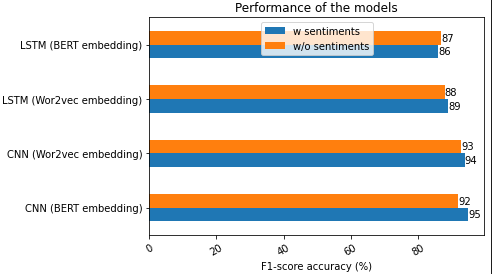

# News_detection_CNN

## Dataset used for creating models

**News Dataset from TI-CNN:** https://drive.google.com/file/d/0B3e3qZpPtccsMFo5bk9Ib3VCc2c/view?usp=sharing&resourcekey=0-_eqAfKOCKbuE-xFFCmEzyg

**Project Structure**  
BERT_CNN - CNN model with BERT embedding and result on Test dataset  
CNN_model - Preprocessing of the dataset with Word2Vec 
Train_CNN - Training of the CNN and result on Test dataset 

